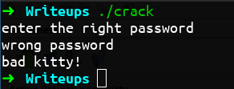
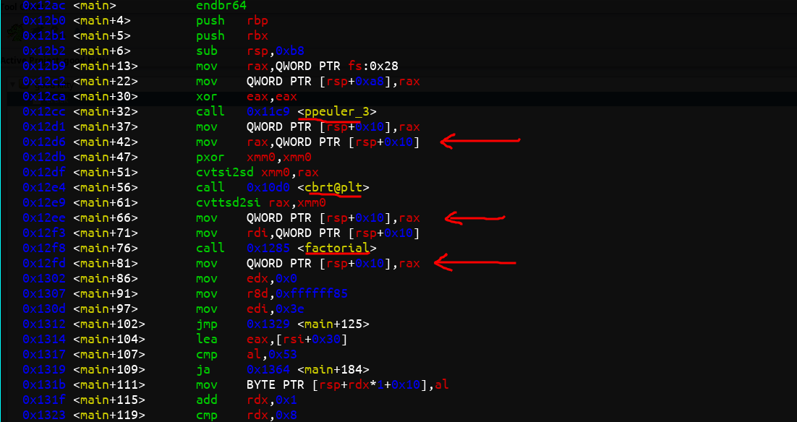
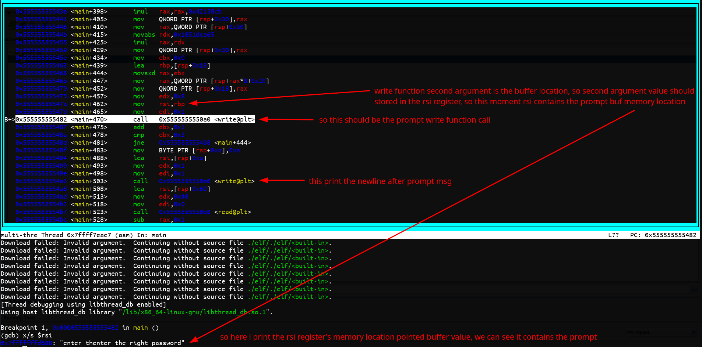
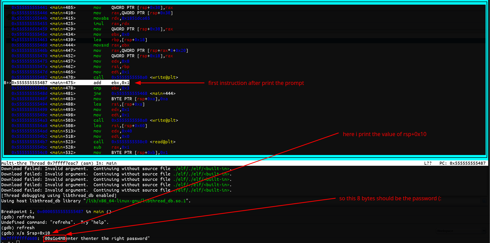
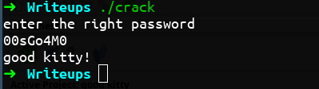

# Emilia161's good kitty

- [Issue Link Here](https://crackmes.one/crackme/68c44e20224c0ec5dcedbf4b)

# Solution Writeup
- first we have to run this, after running it ask the password **enter the right password**
- after entering the password, if password is wrong, it prints **bad kitty!**



- if password is correct, it prints **good kitty!**
- the challenge is find the password
- first we have to look the disassembly, i used the **ghidra** tool for this, disassembly of the **main** look like this.

```c
#include <stdio.h>
#include <stdlib.h>
#include <math.h>

int main(void)
{
    char bVar1;
    ssize_t sVar2;
    long lVar3;
    int iVar4;
    long in_FS_OFFSET;
    double dVar5;
    undefined local_be;
    char local_bd;
    uint local_bc;
    long local_b8;
    undefined8 local_b0;
    undefined8 local_a8 [4];
    undefined8 local_88;
    undefined8 uStack_80;
    undefined8 local_78;
    char local_68 [72];
    long local_20;

    local_20 = *(long *)(in_FS_OFFSET + 0x28);
    local_b8 = ppeuler_3();
    dVar5 = cbrt((double)local_b8);
    local_b8 = (long)dVar5;
    local_b8 = factorial(local_b8);
    lVar3 = 0;

    do {
        bVar1 = *(char *)((long)&local_b8 + lVar3);
        if ((0x19 < (char)((bVar1 & 0xdf) + 0xbf)) && (9 < (char)(bVar1 - 0x30))) {
            bVar1 = bVar1 % 0x3e;
            if ((char)(bVar1 - 10) < 0x1a) {
                *(char *)((long)&local_b8 + lVar3) = bVar1 + 0x37;
            }
            else if ((char)(bVar1 + 0x30) < 0x54) {
                *(char *)((long)&local_b8 + lVar3) = bVar1 + 0x30;
            }
            else {
                *(char *)((long)&local_b8 + lVar3) = bVar1 + 0x3d;
            }
        }
        lVar3 = lVar3 + 1;
    } while (lVar3 != 8);
    local_88 = 1;
    uStack_80 = 1;
    local_78 = 1;

    local_a8[0] = 0x6874207265746e65;
    local_a8[1] = 0x2074686769722065;
    local_a8[2] = 0x64726f7773736170;
    iVar4 = 0;
    do {
        local_b0 = local_a8[iVar4];
        write(1,&local_b0,8);
        iVar4 = iVar4 + 1;
    } while (iVar4 != 3);
    local_be = 10;
    write(1,&local_be,1);

    sVar2 = read(0,local_68,0x40);
    lVar3 = sVar2 + -1;
    local_bd = 1;
    local_bc = 0;
    if (0 < lVar3) {
        do {
            if (7 < local_bc) break;
            if (local_68[(int)local_bc] != *(char *)((long)&local_b8 + (long)(int)local_bc)) {
                local_bd = 0;
            }
            local_bc = local_bc + 1;
        } while ((int)local_bc < lVar3);
    }
    local_bd = lVar3 == 8 & local_bd;
    if (local_bd == 0) {
        puts("bad kitty!");
    }
    else {
        puts("good kitty!");
    }
    if (local_20 == *(long *)(in_FS_OFFSET + 0x28)) {
        return 0;
    }
    /* WARNING: Subroutine does not return */
    __stack_chk_fail();
}
```

- we can get a rough idea about the program with this
- first part that familiar to us is the last msg that print to us according to the password 

```c
local_bd = lVar3 == 8 & local_bd;
if (local_bd == 0) {
    puts("bad kitty!");
}
else {
    puts("good kitty!");
}
```

- other part is the prompt msg, this part is responsible for printing prompt, we can see it by analyzing the hex values

```c
local_a8[0] = 0x6874207265746e65; // this three lines should contains the msg
local_a8[1] = 0x2074686769722065;
local_a8[2] = 0x64726f7773736170;
iVar4 = 0;
do {
    local_b0 = local_a8[iVar4];
    write(1,&local_b0,8);
    iVar4 = iVar4 + 1;
} while (iVar4 != 3);
local_be = 10;
write(1,&local_be,1);
```

- so to confirm that i do some changes to code, this below code print output the prompt as we expected

```c
#include <stdio.h>

int main(void)
{
	long local_a8[4];
	long iVar4 = 0;
	long local_b0;

	// this code print the "enter the right password", without newline 
	local_a8[0] = 0x6874207265746e65;
	local_a8[1] = 0x2074686769722065;
	local_a8[2] = 0x64726f7773736170;

	do {
		local_b0 = local_a8[iVar4];
		write(1, &local_b0, 8);
		iVar4 = iVar4 + 1;
	} while (iVar4 != 3);

	// this code print the newline
	char local_be = 10;
	write(1, &local_be, 1);
}
```

- then we look at the top part of the **main** function 

```c
local_b8 = ppeuler_3();
dVar5 = cbrt((double)local_b8);
local_b8 = (long)dVar5;
local_b8 = factorial(local_b8);
```

- in this part we found some extra fuction calls, **ppeuler_3** and **factorial**
- so these are the disassembly for those functions, (i think here factorial function is corrupted)

```c
#include <stdio.h>

long ppeuler_3(void)
{
    long local_18;
    long local_10;
    long local_8;

    local_18 = 0x8be589eac7;
    local_10 = 2;
    local_8 = 1;
    do {
        if (local_18 % local_10 == 0) {
            local_18 = local_18 / local_10;
            local_8 = local_10;
        }
        else {
            local_10 = local_10 + 1;
        }
    } while (local_10 * local_10 - local_18 == 0 || local_10 * local_10 < local_18);
    if (1 < local_18) {
        local_8 = local_18;
    }
    return local_8;
}

// this function is corrupted
void factorial(long param_1)
{
    if (0 < param_1) {
        do {
            param_1 = param_1 + -1;
        } while (param_1 != 0);
    }
    return;
}

int main(void)
{
    local_b8 = ppeuler_3();
    dVar5 = cbrt((double)local_b8);
    local_b8 = (long)dVar5;
    local_b8 = factorial(local_b8);
}
```

- in here we can see 3 times value assignment to same **local_b8** variable

```c
    local_b8 = ppeuler_3();         // first assignment
    dVar5 = cbrt((double)local_b8);
    local_b8 = (long)dVar5;         // second assignment
    local_b8 = factorial(local_b8); // third assignment 
```

- now we are going to analyze this binary with **gdb**, then we try to find those assignments and function calls 



- so here we can see the 3 function calls, also we can see that assignments of those functions return values to same **[rbp-0x10]**, so this must be the **local_b8** variable 
- after that i go to the **ghidra** disassembly again, here i mention below the code snippet where user input captures 

```c
sVar2 = read(0,local_68,0x40);
lVar3 = sVar2 + -1;
```

- we can see the content of the user input store in **local_68** variable, then read byte count stored in the **sVar2** variable
- after that snippet we can see code snippet that compare user input **local_68** variable's each bytes (8 bytes) with **local_b8** variable's each bytes (8 bytes) 

```c
if (0 < lVar3) {
    do {
        if (7 < local_bc) break;
        if (local_68[(int)local_bc] != *(char *)((long)&local_b8 + (long)(int)local_bc)) {
            local_bd = 0;
        }
        local_bc = local_bc + 1;
    } while ((int)local_bc < lVar3);
}
local_bd = lVar3 == 8 & local_bd; // according to this line lVar3 should be 8 
```

- so we can guess that **lVar3** value should be 8, so **sVar2** value should be 9, that mean our password length should be 8 and last enter keypress added more '\n' character then total count become 9, **sVar2** contains that
- because of **local_68** variable's each byte compare with **local_b8** variable's each byte, we can assume that **local_b8** should contains the actual password
- ok, now we consider what are the more changes that happend to **local_b8** variable, we can see after 3 value assignments below code also change the byte values of the **local_b8** variable 

```c
// this code also not working correctly
lVar3 = 0;
do {
    bVar1 = *(char *)((long)&local_b8 + lVar3);
    if ((0x19 < (char)((bVar1 & 0xdf) + 0xbf)) && (9 < (char)(bVar1 - 0x30))) {
        bVar1 = bVar1 % 0x3e;
        if ((char)(bVar1 - 10) < 0x1a) {
            *(char *)((long)&local_b8 + lVar3) = bVar1 + 0x37;
        }
        else if ((char)(bVar1 + 0x30) < 0x54) {
            *(char *)((long)&local_b8 + lVar3) = bVar1 + 0x30;
        }
        else {
            *(char *)((long)&local_b8 + lVar3) = bVar1 + 0x3d;
        }
    }
    lVar3 = lVar3 + 1;
} while (lVar3 != 8);
```

- i'm unable to fix this code to run correctly ):, but something we know that after changing the bytes of that location, we should see the prompt, because prompt printing code is below that
- so we can do something in gdb is, we can create a breakpoint where this prompt msg printing happend 
- after breakpoint hit, we can analyze the location of the **local_b8** variable, in ourcase in assembly output **rbp-0x10** location, so this location should contains the password (:



- here i analyze the prompt value, after that i also analyze the **rsp+0x10** value, hopefully we can find the password (:



- Yo!, we found the password (:, **00sGo4M0** must be the password, let's check it with the actual binary



- Ok, we successfully found the password (:
